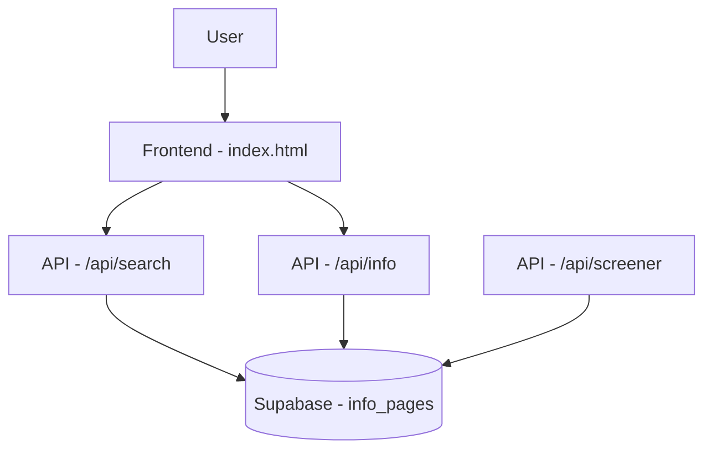

# Architecture Design: Predator PAIM System Upgrades

## 1. Introduction
This document outlines the architectural changes required to fix data ingestion issues, enhance the event search system, and implement a new informational section for the Predator PAIM platform.

## 2. Bug Fix: API Empty Results
The "empty results" issue is likely caused by silent failures in the `morning_screener` data ingestion pipeline (`api/index.py`).

### Proposed Changes:
- **Enhanced Logging**: Replace generic `try...except: continue` blocks in `morning_screener` with detailed logging to track exactly which stage of the pipeline fails (API fetch, data parsing, Shin probability calculation, or Supabase insertion).
- **Robust Error Handling**: Implement specific exception handling to log API rate limits, parsing failures, and database constraint violations.
- **Validation**: Implement a pre-ingestion validation check to ensure necessary data points exist in the API response before insertion into Supabase.

## 3. Feature: Enhanced Event Search
To support precise date/time filtering:

### Database Changes (`supabase.signals`):
- Add `event_time` column (timestamp) to the `signals` table.
- Ensure `created_at` is correctly indexed for efficient querying.

### API Changes:
- New endpoint: `GET /api/search`
- **Parameters**: 
    - `start_date` (ISO timestamp)
    - `end_date` (ISO timestamp)
    - `sport` (string, optional)
- **Implementation**: Update `api/index.py` to query `supabase.table('signals')` with filters (`gte`, `lte`).

### Frontend Changes:
- Add a new "Event Search" control panel in `templates/index.html` featuring date range pickers and a sport selector.

## 4. Feature: Information & Practical Tips
To improve user experience:

### Database Changes:
- Create a new table `info_pages` with columns:
    - `id` (uuid)
    - `title` (text)
    - `content` (text, markdown)
    - `category` (text)
    - `created_at` (timestamp)

### API Changes:
- New endpoint: `GET /api/info`
- Retrieve and return data from the `info_pages` table.

### Frontend Changes:
- Add an "Academy" or "Tips" tab in the `templates/index.html` navigation or sidebar.
- Display cards or an accordion list for informational content.

## 5. Technical Specifications & DB Schema (Summary)

## 6. Verification & Testing
- **Bug Fix**: Verify logs in `predator_paim.log` after triggering manual scan.
- **Search**: Validate `GET /api/search` with Postman or `curl` using different date ranges.
- **Info**: Validate `GET /api/info` and ensure content rendering in the new UI section.
